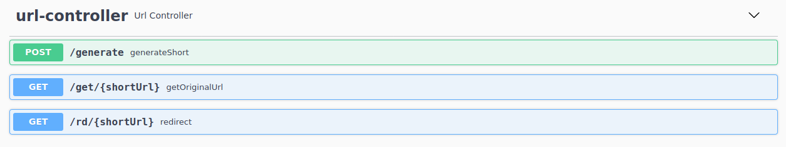

### URL Shortener

###  Think about
* this application will generate a shorter and unique alias for a given url (for url provider).
* user(end user) access our application with shorturl will be redirected to the original url.
* URL redirection should happen in real-time with minimal latency.
* shorturl should be random generated, not guessable.
* short as possible so that more longurl can be mapped.
* to find out:  memories, storage for how many usages.
### API
* /get/{shortUrl}
  * get original url by using short url 
  * request: http://localhost:8080/get/3kQ54t
  * response: ``` { "code":200, "msg":"success", "data":"https://www.tu.berlin/" }```
* /generate
  * get shortUrl by giving original url.
  * request: http://localhost:8080/generate?url=https://www.tu.berlin
  * response: ``` { "code":200, "msg":"success", "data":"3kQ54t" }```
* /rd/{shortUrl}
  * redirect a shorturl to original url. [HTTP 302](https://en.wikipedia.org/wiki/HTTP_302).
  * request: http://localhost:8080/rd/3kQ54t
  * and url will be redirected to https://www.tu.berlin
* /swagger-ui
  * API definition
  * you can test local service by using this utility.
### Impl
* short url will be generated with [MurmurHash](https://en.wikipedia.org/wiki/MurmurHash).
* keyword: [base62, MurmurHash] shortUrl contains 6 chars. 
* using Map as in Memory DB, we can use NoSQL (mongoDB, Cassandra) save shorturl mapping.
* no neccessary to use RDBMS, key-value for short=>long, nosql is perfect solution for prod.
* LRUMap as Cache solution. 

### Security
* Security is a big thing to think about. I have only implemented an interceptor to avoid DDoS attacking.
* only one shorturl will be generated for one IP within 5 seconds.

### Test
* develop test with WebMvcTest, test only business logic UrlController, urlservice will be mocked.
* integration-test with SpringBootTest.
* test with [postman](https://www.postman.com/)
* postman test collection: shorturl_local.postman_collection.json.
 
### requirement
* JDK 8+
* Kotlin 2.7.3
* Gradle

### start single application on host
* gradlew bootrun

### build Docker image and start app in Container
./gradlew build
sudo docker build -t zhairong/shorturl .
sudo docker run -p 8080:8080 zhairong/shorturl
sudo docker run -p 8081:8080 zhairong/shorturl
sudo docker run -p 8082:8080 zhairong/shorturl

### TODO
* This app is not scalable for now, because I used In Memory DB and Cache,it is only for local usage.
* next step is use radis to replace in memory DB and Cache.
* scaling Services per docker-compose